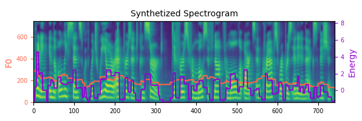
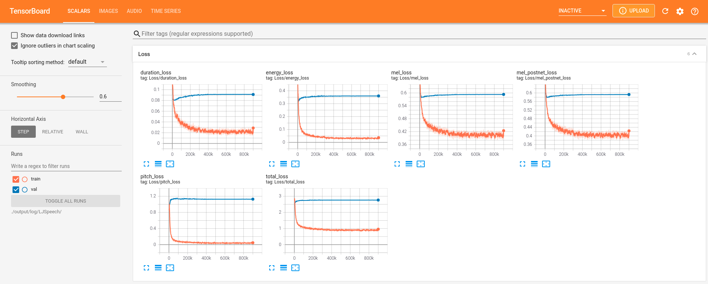
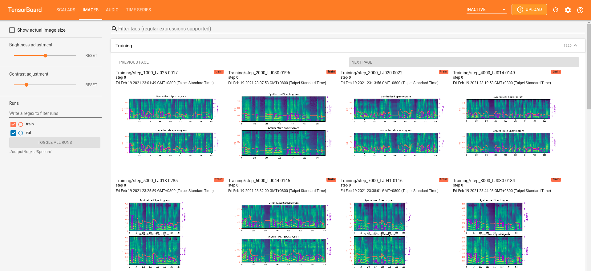
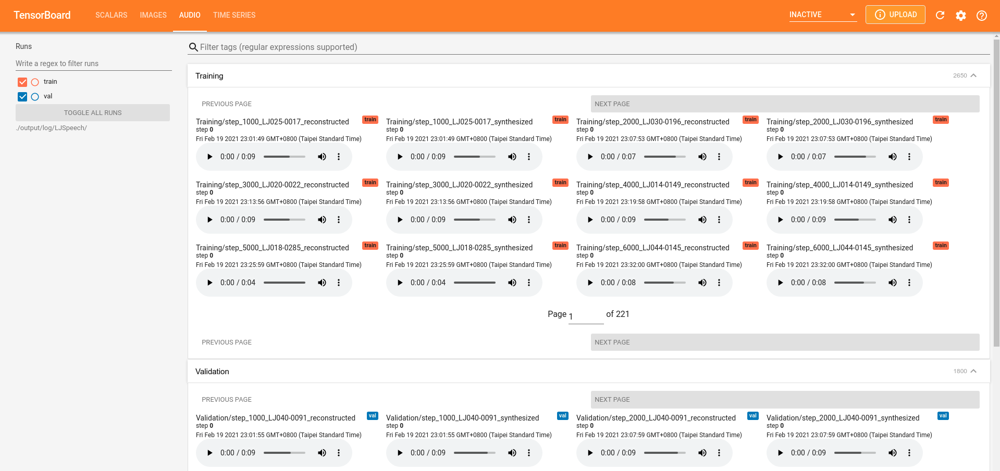

# FastSpeech2 JSUT implementation (Scroll down for original readme)
## How To setup and start training
### Download JSUT
JSUT is available [here](https://sites.google.com/site/shinnosuketakamichi/publication/jsut)
### setup enviornmet and do preprocessing and training
change jsut path in retrieve_transcripts.py to where your jsut folder is 
```
git submodule update --init
pipenv --python 3
pipenv install
unzip hifigan/generator_universal.pth.tar.zip -d hifigan/

mkdir -p raw_data/JSUT/JSUT
cp path/to/JSUT/*/wav/*.wav raw_data/JSUT/JSUT
python retrieve_transcripts.py
python prepare_tg_accent.py jsut-lab/ preprocessed_data/JSUT/ JSUT
python3 preprocess.py config/JSUT/preprocess.yaml #this may take some time
python train.py -p config/JSUT/preprocess.yaml -m config/JSUT/model.yaml -t config/JSUT/train.yaml
```
## Synthesize Japanese
Synthesis Example
```
python3 synthesize.py --text "音声合成、たのちい" --speak
er_id 0 --restore_step 20000 --mode single -p config/JSUT/preprocess.yaml -m config/JSUT/model.yaml -t config/JSUT/train.y
aml
```

# FastSpeech 2 - PyTorch Implementation

This is a PyTorch implementation of Microsoft's text-to-speech system [**FastSpeech 2: Fast and High-Quality End-to-End Text to Speech**](https://arxiv.org/abs/2006.04558v1). 
This project is based on [xcmyz's implementation](https://github.com/xcmyz/FastSpeech) of FastSpeech. Feel free to use/modify the code.

There are several versions of FastSpeech 2.
This implementation is more similar to [version 1](https://arxiv.org/abs/2006.04558v1), which uses F0 values as the pitch features.
On the other hand, pitch spectrograms extracted by continuous wavelet transform are used as the pitch features in the [later versions](https://arxiv.org/abs/2006.04558).


# Updates
- 2021/2/26: Support English and Mandarin TTS
- 2021/2/26: Support multi-speaker TTS (AISHELL-3 and LibriTTS)
- 2021/2/26: Support MelGAN and HiFi-GAN vocoder

# Audio Samples
Audio samples generated by this implementation can be found [here](https://ming024.github.io/FastSpeech2/). 

# Quickstart

## Dependencies
You can install the Python dependencies with
```
pip3 install -r requirements.txt
```

## Inference

You have to download the [pretrained models](https://drive.google.com/drive/folders/1DOhZGlTLMbbAAFZmZGDdc77kz1PloS7F?usp=sharing) and put them in ``output/ckpt/LJSpeech/`` or ``output/ckpt/AISHELL3``.

For English single-speaker TTS, run
```
python3 synthesize.py --text "YOUR_DESIRED_TEXT" --restore_step 900000 --mode single -p config/LJSpeech/preprocess.yaml -m config/LJSpeech/model.yaml -t config/LJSpeech/train.yaml
```

For Mandarin multi-speaker TTS, try
```
python3 synthesize.py --text "大家好" --speaker_id SPEAKER_ID --restore_step 900000 --mode single -p config/LJSpeech/preprocess.yaml -m config/LJSpeech/model.yaml -t config/LJSpeech/train.yaml
```

The generated utterances will be put in ``output/result/``.

Here is an example of synthesized mel-spectrogram of the sentence "Printing, in the only sense with which we are at present concerned, differs from most if not from all the arts and crafts represented in the Exhibition", with the English single-speaker TTS model.  


## Batch Inference
Batch inference is also supported, try

```
python3 synthesize.py --source preprocessed_data/LJSpeech/val.txt --restore_step 900000 --mode batch -p config/LJSpeech/preprocess.yaml -m config/LJSpeech/model.yaml -t config/LJSpeech/train.yaml
```
to synthesize all utterances in ``preprocessed_data/LJSpeech/val.txt``

## Controllability
The pitch/volume/speaking rate of the synthesized utterances can be controlled by specifying the desired pitch/energy/duration ratios.
For example, one can increase the speaking rate by 20 % and decrease the volume by 20 % by

```
python3 synthesize.py --text "YOUR_DESIRED_TEXT" --restore_step 900000 --mode single -p config/LJSpeech/preprocess.yaml -m config/LJSpeech/model.yaml -t config/LJSpeech/train.yaml --duration_control 0.8 --energy_control 0.8
```

# Training

## Datasets

The supported datasets are

- [LJSpeech](https://keithito.com/LJ-Speech-Dataset/): a single-speaker English dataset consists of 13100 short audio clips of a female speaker reading passages from 7 non-fiction books, approximately 24 hours in total.
- [AISHELL-3](http://www.aishelltech.com/aishell_3): a Mandarin TTS dataset with 218 male and female speakers, roughly 85 hours in total.
- [LibriTTS](https://research.google/tools/datasets/libri-tts/): a multi-speaker English dataset containing 585 hours of speech by 2456 speakers.

We take LJSpeech as an example hereafter.

## Preprocessing
 
First, run 
```
python3 prepare_align.py config/LJSpeech/preprocess.yaml
```
for some preparations.

As described in the paper, [Montreal Forced Aligner](https://montreal-forced-aligner.readthedocs.io/en/latest/) (MFA) is used to obtain the alignments between the utterances and the phoneme sequences.
Alignments for the LJSpeech and AISHELL-3 datasets are provided [here](https://drive.google.com/drive/folders/1DBRkALpPd6FL9gjHMmMEdHODmkgNIIK4?usp=sharing).
You have to unzip the files in ``preprocessed_data/LJSpeech/TextGrid/``.

After that, run the preprocessing script by
```
python3 preprocess.py config/LJSpeech/preprocess.yaml
```

Alternately, you can align the corpus by yourself. 
Download the official MFA package and run
```
./montreal-forced-aligner/bin/mfa_align raw_data/LJSpeech/ lexicon/librispeech-lexicon.txt english preprocessed_data/LJSpeech
```
or
```
./montreal-forced-aligner/bin/mfa_train_and_align raw_data/LJSpeech/ lexicon/librispeech-lexicon.txt preprocessed_data/LJSpeech
```

to align the corpus and then run the preprocessing script.
```
python3 preprocess.py config/LJSpeech/preprocess.yaml
```

## Training

Train your model with
```
python3 train.py -p config/LJSpeech/preprocess.yaml -m config/LJSpeech/model.yaml -t config/LJSpeech/train.yaml
```

The model takes less than 10k steps (less than 1 hour on my GTX1080Ti GPU) of training to generate audio samples with acceptable quality, which is much more efficient than the autoregressive models such as Tacotron2.

# TensorBoard

Use
```
tensorboard --logdir output/log/LJSpeech
```

to serve TensorBoard on your localhost.
The loss curves, synthesized mel-spectrograms, and audios are shown.





# Implementation Issues

- Following [xcmyz's implementation](https://github.com/xcmyz/FastSpeech), I use an additional Tacotron-2-styled Postnet after the decoder, which is not used in the original paper.
- Gradient clipping is used in the training.
- In my experience, using phoneme-level pitch and energy prediction instead of frame-level prediction results in much better prosody, and normalizing the pitch and energy features also helps. Please refer to ``config/README.md`` for more details.

Please inform me if you find any mistakes in this repo, or any useful tips to train the FastSpeech 2 model.

# References
- [FastSpeech 2: Fast and High-Quality End-to-End Text to Speech](https://arxiv.org/abs/2006.04558), Y. Ren, *et al*.
- [xcmyz's FastSpeech implementation](https://github.com/xcmyz/FastSpeech)
- [TensorSpeech's FastSpeech 2 implementation](https://github.com/TensorSpeech/TensorflowTTS)
- [rishikksh20's FastSpeech 2 implementation](https://github.com/rishikksh20/FastSpeech2)

# Citation
```
@misc{chien2021investigating,
  title={Investigating on Incorporating Pretrained and Learnable Speaker Representations for Multi-Speaker Multi-Style Text-to-Speech}, 
  author={Chung-Ming Chien and Jheng-Hao Lin and Chien-yu Huang and Po-chun Hsu and Hung-yi Lee},
  year={2021},
  eprint={2103.04088},
  archivePrefix={arXiv},
  primaryClass={eess.AS}
}
```
