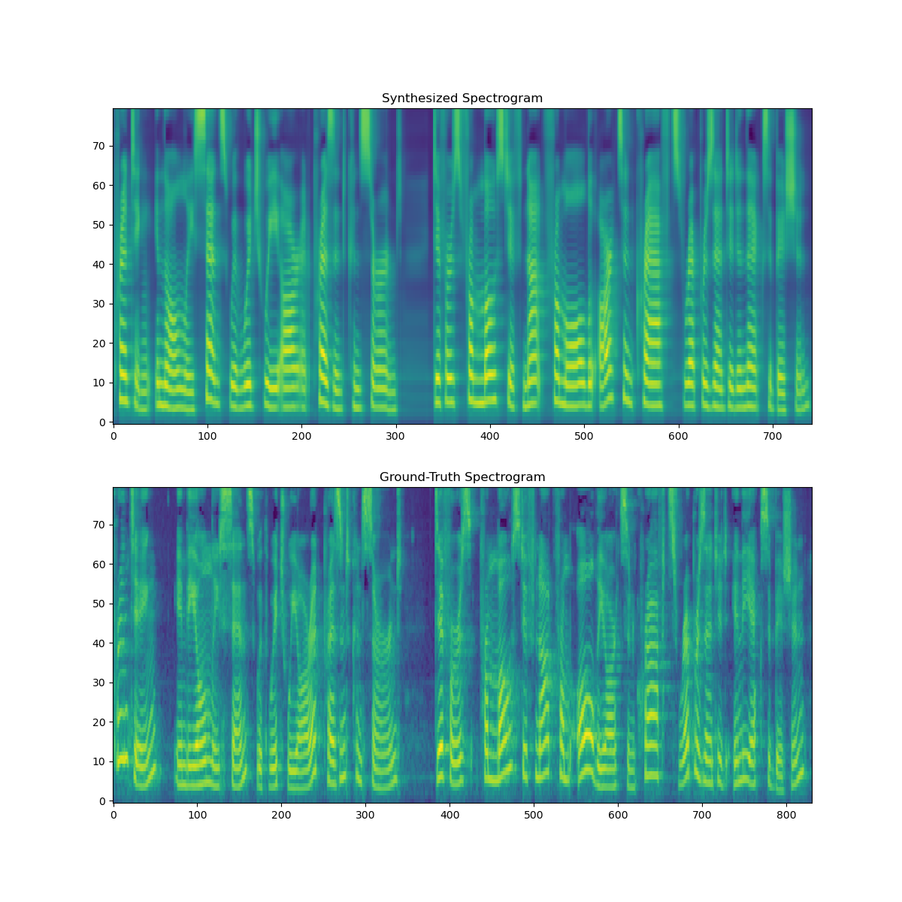

# FastSpeech 2 - Pytorch Implementation

This is a Pytorch implementation of Microsoft's text-to-speech system [**FastSpeech 2: Fast and High-Quality End-to-End Text to Speech**](https://arxiv.org/abs/2006.04558). This project is based on [xcmyz's implementation](https://github.com/xcmyz/FastSpeech) of FastSpeech. Feel free to use/modify the code. Any improvement suggestion is appreciated.

# Audio Samples
Audio samples generated by this implementation can be found [here](https://ming024.github.io/FastSpeech2/).  
- The model used to generate these samples is trained for 30k steps on [LJSpeech](https://keithito.com/LJ-Speech-Dataset/) dataset.
- Audio samples are converted from mel-spectrogram to raw waveform via [NVIDIA's pretrained WaveGlow](https://github.com/NVIDIA/waveglow).

# Quickstart

## Dependencies
You can install the python dependencies with
```
pip3 install -r requirements.txt
```
Noticeably, because I use a new functionality ``torch.bucketize``, which is only supported in PyTorch 1.6, you have to install the nightly build by
```
pip3 install --pre torch==1.6.0.dev20200428 -f https://download.pytorch.org/whl/nightly/cu102/torch_nightly.html
```

Since PyTorch 1.6 is still unstable, I suggest that Python virtual environment should be used.

## Synthesis

You have to download [NVIDIA's pretrained WaveGlow](https://github.com/NVIDIA/waveglow) and put the checkpoint in the ``waveglow/pretrained_model/`` directory, and download our [FastSpeech2 pretrained model](https://drive.google.com/file/d/1jXNDPMt1ybTN97_MztoTFyrPIthoQuSO/view?usp=sharing) then put it in the ``ckpt/LJSpeech/`` directory.

Your can run
```
python3 synthesis.py --step 300000
```
to generate any utterances you wish to. The generated utterances will be put in the ``results/`` directory.

Here is a generated spectrogram of the sentence "Printing, in the only sense with which we are at present concerned, differs from most if not from all the arts and crafts represented in the Exhibition"  
<div style="text-align:center"></div>

# Training

## Datasets
This project supports two datasets:
- [LJSpeech](https://keithito.com/LJ-Speech-Dataset/): consisting of 13100 short audio clips of a single female speaker reading passages from 7 non-fiction books, approximately 24 hours in total.
- [Blizzard2013](http://www.cstr.ed.ac.uk/projects/blizzard/2013/lessac_blizzard2013/): a male speaker reading 10 audio books. The prosody variance are greater than the LJSpeech dtaaset. Only the 9741 segmented utterances are used in this project.
 
```
wget https://data.keithito.com/data/speech/LJSpeech-1.1.tar.bz2
```

After downloading the dataset, extract the compressed files, you have to modify the ``hp.data_path`` and some other parameters in ``hparams.py``. Default parameters are for the LJSpeech dataset.

## Preprocessing

As described in the paper, [Montreal Forced Aligner](https://montreal-forced-aligner.readthedocs.io/en/latest/)(MFA) is used to obtain the alignment between utterance and phoneme sequence. Alignments for the LJSpeech dataset is provided [here](https://drive.google.com/file/d/1ukb8o-SnqhXCxq7drI3zye3tZdrGvQDA/view?usp=sharing). You have to put the ``TextGrid.zip`` file in your ``hp.preprocessed_path/`` and extract the files before you continue.

Then run the preprocessing sctipt by
```
python3 preprocess.py
```

Alternately, you can align the corpus by yourself. First, download the MFA package and the pretrained lexicon file. (We use LibriSpeech lexicon instead of the G2p_en python package proposed in the paper)

```
wget https://github.com/MontrealCorpusTools/Montreal-Forced-Aligner/releases/download/v1.1.0-beta.2/montreal-forced-aligner_linux.tar.gz
tar -zxvf montreal-forced-aligner_linux.tar.gz

wget http://www.openslr.org/resources/11/librispeech-lexicon.txt -O montreal-forced-aligner/pretrained_models/librispeech-lexicon.txt
```

Then prepare some necessary files required by the MFA.

```
python3 prepare_align.py
```

Running MFA and put the .TextGrid files in your ``hp.preprocessed_path``.
```
# Replace $DATA_PATH and $PREPROCESSED_PATH with ./LJSpeech-1.1 and ./preprocessed/LJSpeech/TextGrid, for example
./montreal-forced-aligner/bin/mfa_align $YOUR_DATA_PATH montreal-forced-aligner/pretrained_models/librispeech-lexicon.txt english $YOUR_PREPROCESSED_PATH -j 8
```

Remember to run the preprocessing sctipt.
```
python3 preprocess.py
```

After preprocessing, you will get a ``stat.txt`` file in your ``hp.preprocessed_path/``, recording the maximum and minimum values of the fundamental frequency and energy values in the entire corpus. You have to modify the f0 and energy parameters in the ``hparams.py`` according to your ``stat.txt`` file.

## Training

Train your model with
```
python3 train.py
```

There might be some room for improvement for this repository. For example, I just simply add up 


MFA with punctuation...?
input embedding dropout...?
additional postnet
gradient clipping
weight decay
L1 loss or L2 loss?
weights of the loss terms?
loss masking
eval the output
some problem in eval.py(dataset)
util/plot