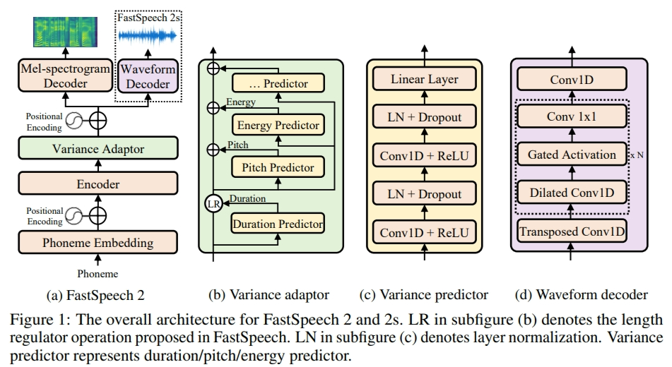
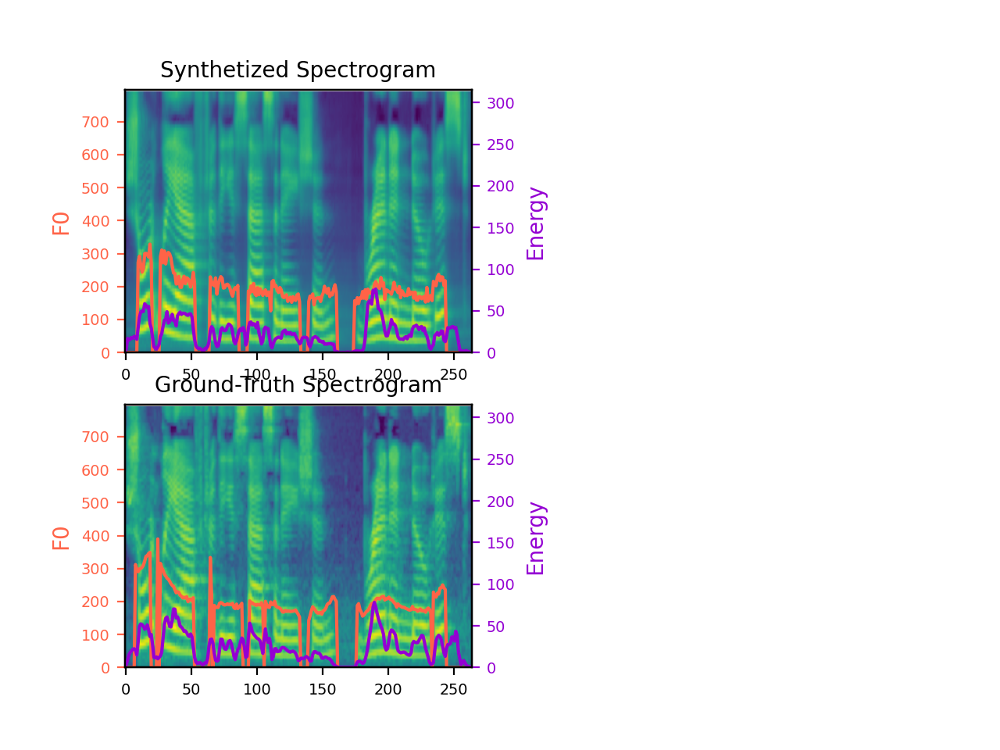
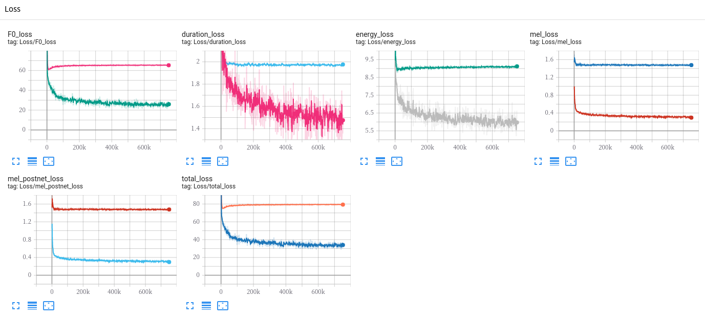

# FastSpeech 2 - PyTorch Implementation

This is a PyTorch implementation of Microsoft's text-to-speech system [**FastSpeech 2: Fast and High-Quality End-to-End Text to Speech**](https://arxiv.org/abs/2006.04558). 
This project is based on [xcmyz's implementation](https://github.com/xcmyz/FastSpeech) of FastSpeech. Feel free to use/modify the code. 
Any suggestion for improvement is appreciated.

This repository contains only FastSpeech 2 but FastSpeech 2s so far.
I will update it once I reproduce FastSpeech 2s, the end-to-end version of FastSpeech2, successfully.



# Audio Samples
Audio samples generated by this implementation can be found [here](https://ming024.github.io/FastSpeech2/).  
- The model used to generate these samples is trained for 300k steps on the [LJSpeech](https://keithito.com/LJ-Speech-Dataset/) dataset.
- Audio samples are converted from mel-spectrogram to raw waveform via [NVIDIA's pretrained WaveGlow](https://github.com/NVIDIA/waveglow) and [seungwonpark's pretrained MelGAN](https://github.com/seungwonpark/melgan).

# Quickstart

## Dependencies
You can install the python dependencies with
```
pip3 install -r requirements.txt
```

## Synthesis

You have to download our [FastSpeech2 pretrained model](https://drive.google.com/file/d/1jXNDPMt1ybTN97_MztoTFyrPIthoQuSO/view?usp=sharing) and put it in the ``ckpt/LJSpeech/`` directory.

Your can run
```
python3 synthesis.py --step 300000
```
to generate any desired utterances. 
The generated utterances will be put in the ``results/`` directory.

Here is a generated spectrogram of the sentence "Printing, in the only sense with which we are at present concerned, differs from most if not from all the arts and crafts represented in the Exhibition"  


For CPU inference please refer to this [colab tutorial](https://colab.research.google.com/drive/1S60pytpB1OcEFrd-SkYyjtBsBHYepRSG?usp=sharing). One has to clone the original repo of [MelGAN](https://github.com/seungwonpark/melgan) instead of using ``torch.hub`` due to the code architecture of MelGAN.

# Training

## Datasets
We use the [LJSpeech](https://keithito.com/LJ-Speech-Dataset/) English dataset, which consists of 13100 short audio clips of a single female speaker reading passages from 7 non-fiction books, approximately 24 hours in total, to train the entire model end-to-end.

After downloading the dataset and extracting the compressed files, you have to modify the ``hp.data_path`` and some other parameters in ``hparams.py``. 
Default parameters are for the LJSpeech dataset.

## Preprocessing

As described in the paper, [Montreal Forced Aligner](https://montreal-forced-aligner.readthedocs.io/en/latest/)(MFA) is used to obtain the alignments between the utterances and the phoneme sequences. 
Alignments for the LJSpeech dataset is provided [here](https://drive.google.com/file/d/1ukb8o-SnqhXCxq7drI3zye3tZdrGvQDA/view?usp=sharing). 
You have to put the ``TextGrid.zip`` file in your ``hp.preprocessed_path/`` and extract the files before you continue.

After that, run the preprocessing script by
```
python3 preprocess.py
```

Alternately, you can align the corpus by yourself. 
First download the MFA package and the pretrained lexicon file. (We use LibriSpeech lexicon instead of the G2p\_en python package proposed in the paper)

```
wget https://github.com/MontrealCorpusTools/Montreal-Forced-Aligner/releases/download/v1.1.0-beta.2/montreal-forced-aligner_linux.tar.gz
tar -zxvf montreal-forced-aligner_linux.tar.gz

wget http://www.openslr.org/resources/11/librispeech-lexicon.txt -O montreal-forced-aligner/pretrained_models/librispeech-lexicon.txt
```

Then prepare some necessary files required by the MFA.

```
python3 prepare_align.py
```

Run the MFA and put the .TextGrid files in your ``hp.preprocessed_path``.
```
# Replace $DATA_PATH and $PREPROCESSED_PATH with ./LJSpeech-1.1/wavs and ./preprocessed/LJSpeech/TextGrid, for example
./montreal-forced-aligner/bin/mfa_align $YOUR_DATA_PATH montreal-forced-aligner/pretrained_models/librispeech-lexicon.txt english $YOUR_PREPROCESSED_PATH -j 8
```

And remember to run the preprocessing script.
```
python3 preprocess.py
```

After preprocessing, you will get a ``stat.txt`` file in your ``hp.preprocessed_path/``, recording the maximum and minimum values of the fundamental frequency and energy values throughout the entire corpus.
You have to modify the f0 and energy parameters in the ``hparams.py`` according to the content of ``stat.txt``.

## Training

Train your model with
```
python3 train.py
```

The model takes less than 10k steps (less than 1 hour on my GTX1080 GPU) of training to generate audio samples with acceptable quality, which is much more efficient than the autoregressive models such as Tacotron2.

There might be some room for improvement for this repository.
For example, I just simply add up the duration loss, f0 loss, energy loss and mel loss without any weighting.

# TensorBoard

The TensorBoard loggers are stored in the ``log/hp.dataset/`` directory. Use
```
tensorboard --logdir log/hp.dataset/
```
to serve the TensorBoard on your localhost.
Here is an example training the model on LJSpeech for 400k steps.



# Notes

## Implementation Issues

There are several differences between my implementation and the paper.
- The paper includes punctuations in the transcripts. 
  However, MFA discards punctuations by default and I haven't found a way to solve it. 
  During inference, I replace all punctuations with the ``sp`` (short-pause) phone labels.
- Following [xcmyz's implementation](https://github.com/xcmyz/FastSpeech), I use an additional Tacotron-2-styled postnet after the FastSpeech decoder, which is not used in the original paper.
- The [transformer paper](https://arxiv.org/abs/1706.03762) suggests to use dropout after the input and positional embedding.
  I find that this trick does not make any observable difference so I do not use dropout for positional embedding.
- The paper suggest to use L1 loss for mel loss and L2 loss for variance predictor losses.
  But I find it easier to train the model with L2 mel loss and L1 variance adaptor losses.
- Gradient clipping is used in the training.

Some tips for training this model.
- You can set the ``hp.acc_steps`` parameter if you wish to train with a large batchsize on a GPU with limited memory.
- In my experience, carefully masking out the padded parts in loss computation and in model forward parts largely improves the performance.

Please inform me if you find any mistake in this repo, or any useful tip to train the FastSpeech2 model.

## TODO
- Try difference weights for the loss terms.
- Evaluate the quality of the synthesized audio over the validation set.
- Multi-speaker, voice cloning, or transfer learning experiment.
- Implement FastSpeech 2s.

# References
- [FastSpeech 2: Fast and High-Quality End-to-End Text to Speech](https://arxiv.org/abs/2006.04558), Y. Ren, *et al*.
- [FastSpeech: Fast, Robust and Controllable Text to Speech](https://arxiv.org/abs/1905.09263), Y. Ren, *et al*.
- [xcmyz's FastSpeech implementation](https://github.com/xcmyz/FastSpeech)
- [rishikksh20's FastSpeech2 implementation](https://github.com/rishikksh20/FastSpeech2)
- [TensorSpeech's FastSpeech2 implementation](https://github.com/TensorSpeech/TensorflowTTS)
- [NVIDIA's WaveGlow implementation](https://github.com/NVIDIA/waveglow)
- [seungwonpark's MelGAN implementation](https://github.com/seungwonpark/melgan)
